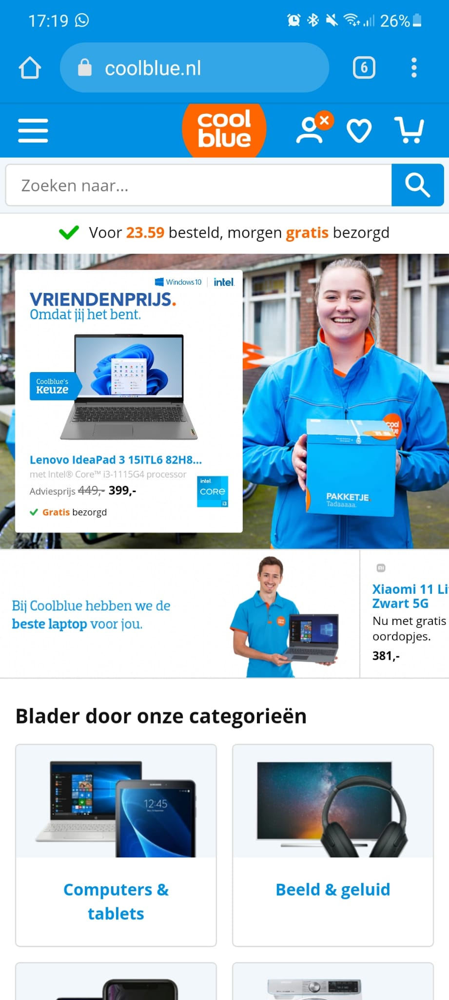
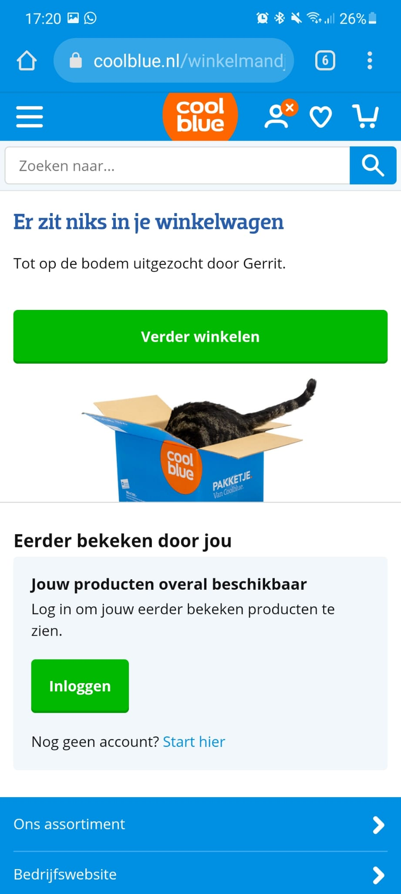
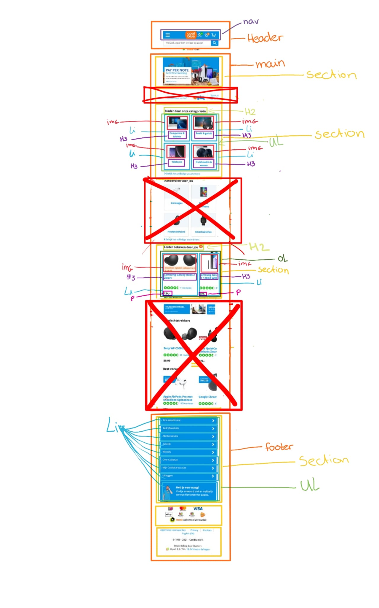
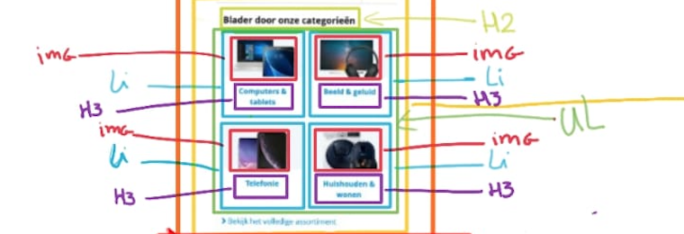
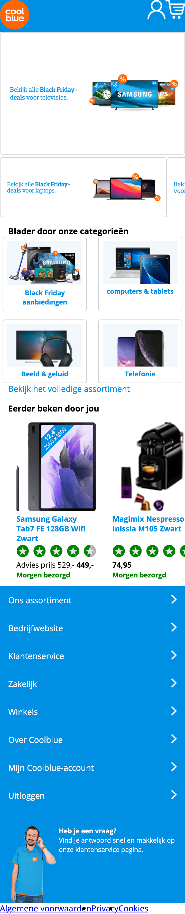
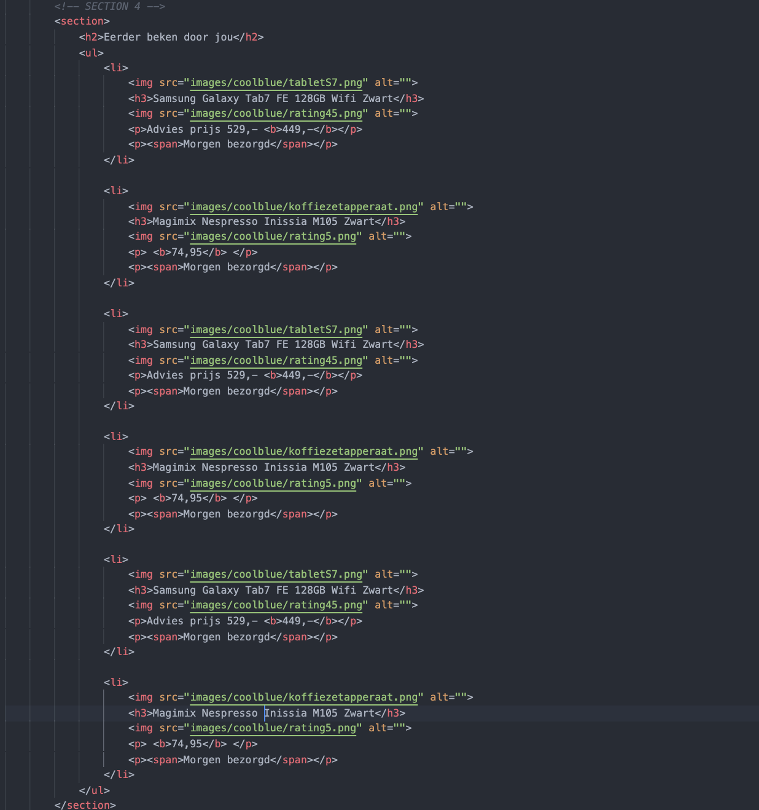
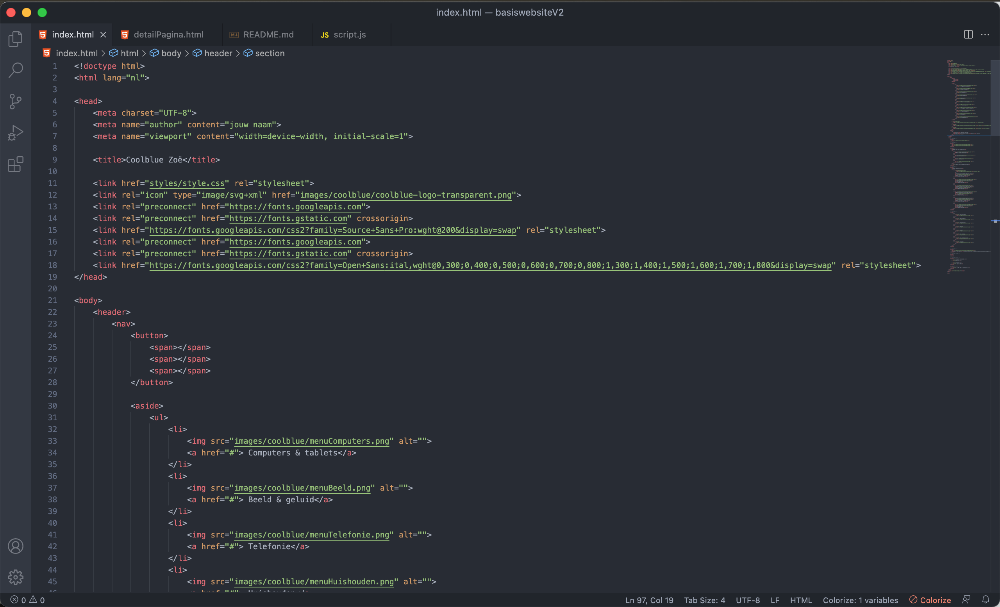
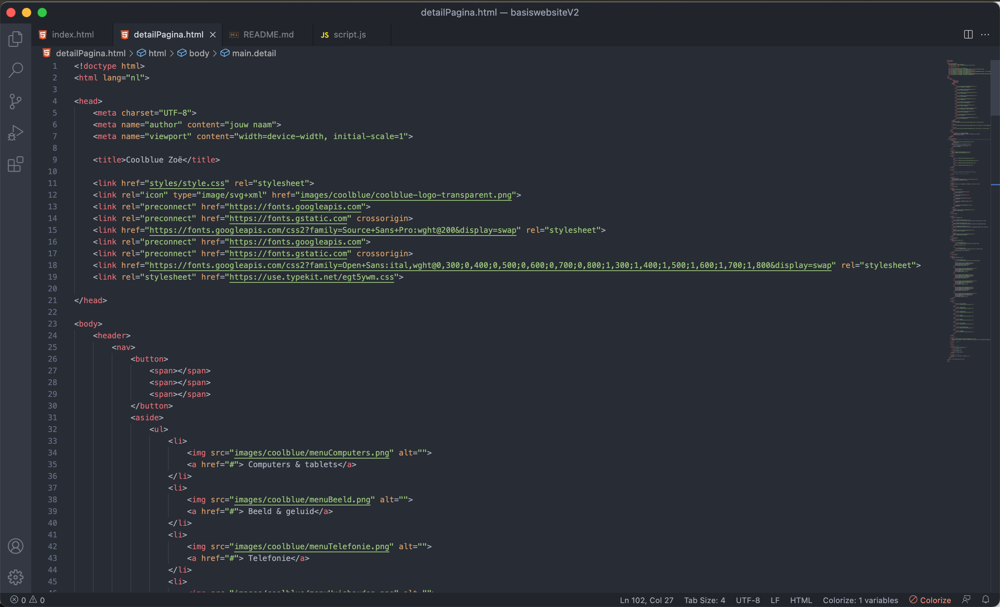
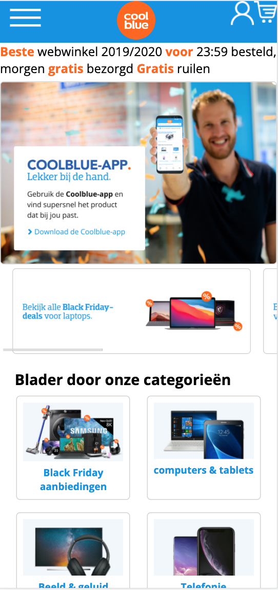
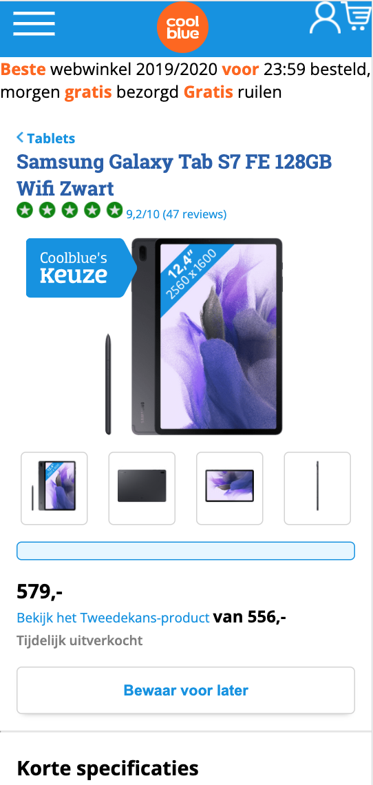

# Procesverslag
Markdown is een simpele manier om HTML te schrijven.  
Markdown cheat cheet: [Hulp bij het schrijven van Markdown](https://github.com/adam-p/markdown-here/wiki/Markdown-Cheatsheet).

Nb. De standaardstructuur en de spartaanse opmaak van de README.md zijn helemaal prima. Het gaat om de inhoud van je procesverslag. Besteedt de tijd voor pracht en praal aan je website.

Nb. Door *open* toe te voegen aan een *details* element kun je deze standaard open zetten. Fijn om dat steeds voor de relevante stuk(ken) te doen.

## Jij

uitwerken voor kick-off werkgroep

### Auteur:
Zoë Reijinga

#### Je startniveau:
Rood

#### Je focus:
hier je focus (kies uit responsive óf surface plane)
 

## Je website

uitwerken voor kick-off werkgroep

### Je opdracht:
https://www.coolblue.nl/

#### Screenshot(s) van de eerste pagina (small screen): 
Homepage  

#### Screenshot(s) van de tweede pagina (small screen):
Winkelwagen  

 

## Breakdownschets (week 1)

uitwerken na afloop 2e werkgroep

### De hele pagina (Homepage): 

### dynamisch deel (bijv menu): 

<!-- ### wellicht nog een dynamisch deel (bijv filter): 
 -->

## Voortgang 1 (week 2)

uitwerken voor 1e voortgang

### Stand van zaken
Ik begin Flexbox steeds meer te snappen. Ik ben zelf door mijn vorige opleiding heel erg gewend om met bootstrap te werken dus het is nog een hele omschakeling naar flexbox maar tot nu toe gaat dat redelijk.

Ik heb bijne mijn eerste pagina af. Ik moet nog de header en de footer goed krijgen.

Dit is een stukje code. Dit gaat over section 4. Ik zet eigenlijk bijna alles in UL LI

### Agenda voor meeting
samen met je groepje opstellen

| Anneke Steller  | Aris Rosbach       |  Max van Liempt    |  Fleur Oostingh        | Zoë Reijinga
| ---             | ---                | ---                | ---                    | ---    
| Ze wilde aangeven dat ze nog wat achterloopt | Had een probleem met de margins  | Geen punten    |Wanneer je het beste een DIV gebruikt| Geen punten
|     |      |  |  |
| ...                           | ...                | ...          | ...              |...

### Verslag van meeting
Uitkosmten

- Anneke liep eigenlijk nog niet zo heel ver achter als zij zelf dacht.
- Fleur had een voorbeeld met allerlei foto's wat ze in een div had gezet. Ze kon dit beter in een list item kunnen zetten,

## Voortgang 2 (week 3)

uitwerken voor 2e voortgang

### Stand van zaken
Op dit moment heb ik mijn 2 pagina af. Op een paar kleine details na. Zoals de slider met tekst bonven in de pagina moet nog uitzichzelf slide.

### Agenda voor meeting
samen met je groepje opstellen

| Aris Rosbach      | Max van Liempt          | Laurens Duin    | Zoë Reijinga        |
| ---            | ---                | ---          | ---              |
| Aris wilde graag wat tips voor het gebruiken grid  | Max vroeg zich af hoe hij zijn divjes kon vervangen voor iets anders            | Had geen vragen    | Ik had ook geen vragen    |

### Verslag van meeting
In ons groepje was er niemand die echt vastliep en daardoor ook niet echt specifieke vragen had voor de studentassistentent. Iedereen liet zijn code even zien waardoor de studenassistenten daar wat tips konden geven.

- We begonnen bij Aris haar code. Aris had de vraag over Grid. Uiteindelijk kwam het erop neer dat ze vooral moest gaan proberen en kijken wat wel en wat niet werkt. Omdat Aris resposive wil maken werd er gezegd dat ze goed moest opletten met de media queries.
- Daarna ging ik mijn code laten zien. Ze vonden het goed dat ik veel comments had geplaats en ook bij elke sectie een comment geplaats met welke sectie het is zodat ik niet in de war zou raken.
- Laurens zijn code zag er ook goed uit. Hij had ook veel comments gebruikt in zijn html
- Max liet ook zijn code zien. Wat de studentassistenten meteen opviel is dat hij heel veel divjes heeft gebruikt. Daardom was zijn vraag ook hoe hij deze kon vervangen. Ze gaven als tips om list items of articles te gebruiken.

Het zag er bij iedereen goed uit. We zijn nog goed op schema.

## Toegankelijkheidstest (week 4)

uitwerken na test in 8e voortgang

### Bevindingen
Lijst met je bevindingen die in de test naar voren kwamen:

#### Titel eerste bevinding
Hier korte omschrijving (met indien nodig een afbeelding)

Hier een omschrijving van hoe het opgelost kan worden (met indien nodig een afbeelding)

#### Titel tweede bevinding. 
Hier korte omschrijving (met indien nodig een afbeelding)

Hier een omschrijving van hoe het opgelost kan worden (met indien nodig een afbeelding)

#### Titel volgende bevinding. 
Hier korte omschrijving (met indien nodig een afbeelding)

Hier een omschrijving van hoe het opgelost kan worden (met indien nodig een afbeelding)

#### Titel nog een bevinding. 
Hier korte omschrijving (met indien nodig een afbeelding)

Hier een omschrijving van hoe het opgelost kan worden (met indien nodig een afbeelding)

## Voortgang 3 (week 4)

uitwerken voor 3e voortgang

### Stand van zaken
hier dit ging goed & dit was lastig (neem ook screenshots op van delen van je website en code)

### Agenda voor meeting
samen met je groepje opstellen

| student 1      | student 2          | student 3    | student 4        |
| ---            | ---                | ---          | ---              |
| dit bespreken  | en dit             | en ik dit    | en dan ik dat    |
| en dat ook nog | dit als er tijd is | nog een punt | dit wil ik zeker |
| ...            | ...                | ...          | ...              |

### Verslag van meeting
hier na afloop snel de uitkomsten van de meeting vastleggen

- punt 1
- punt 2
- nog een punt
- ...

## Eindgesprek (week 5)

uitwerken voor eindgesprek

### Stand van zaken
hier dit ging goed & dit was lastig (neem ook screenshots op van delen van je website en code)

### Screenshot(s)

hier screenshot(s) van je eindresultaat

## Bronnenlijst

continu bijhouden terwijl je werkt

Nb. Wees specifiek ('css-tricks' als bron is bijv. niet specifiek genoeg).

1. bron 1
2. bron 2
3. ...

