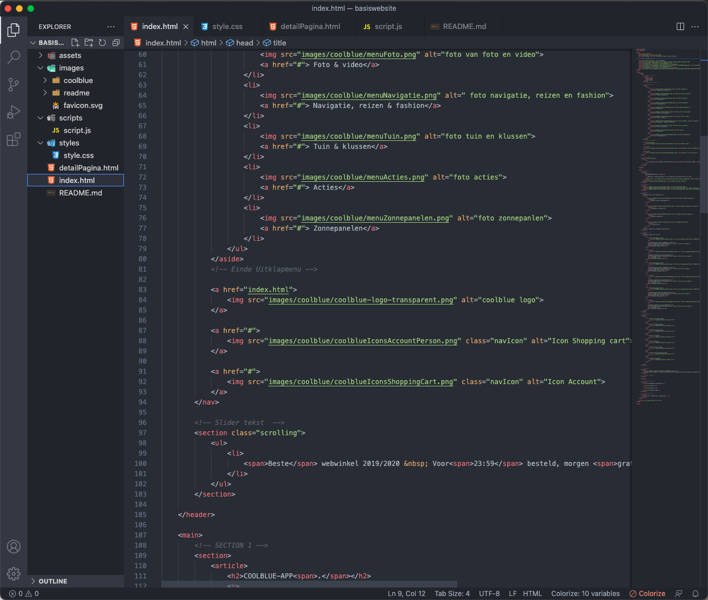

# Procesverslag
Markdown is een simpele manier om HTML te schrijven.  
Markdown cheat cheet: [Hulp bij het schrijven van Markdown](https://github.com/adam-p/markdown-here/wiki/Markdown-Cheatsheet).

Nb. De standaardstructuur en de spartaanse opmaak van de README.md zijn helemaal prima. Het gaat om de inhoud van je procesverslag. Besteedt de tijd voor pracht en praal aan je website.

Nb. Door *open* toe te voegen aan een *details* element kun je deze standaard open zetten. Fijn om dat steeds voor de relevante stuk(ken) te doen.

## Jij

uitwerken voor kick-off werkgroep

### Auteur:
Zoë Reijinga

#### Je startniveau:
Rood

#### Je focus:
hier je focus (kies uit responsive óf surface plane)
 

## Je website

uitwerken voor kick-off werkgroep

### Je opdracht:
https://www.coolblue.nl/

#### Screenshot(s) van de eerste pagina (small screen): 
Homepage  

#### Screenshot(s) van de tweede pagina (small screen):
Winkelwagen  

 

## Breakdownschets (week 1)

uitwerken na afloop 2e werkgroep

### De hele pagina (Homepage): 

### dynamisch deel (bijv menu): 

<!-- ### wellicht nog een dynamisch deel (bijv filter): 
 -->

## Voortgang 1 (week 2)

uitwerken voor 1e voortgang

### Stand van zaken
Ik begin Flexbox steeds meer te snappen. Ik ben zelf door mijn vorige opleiding heel erg gewend om met bootstrap te werken dus het is nog een hele omschakeling naar flexbox maar tot nu toe gaat dat redelijk.

Ik heb bijne mijn eerste pagina af. Ik moet nog de header en de footer goed krijgen.

Dit is een stukje code. Dit gaat over section 4. Ik zet eigenlijk bijna alles in UL LI

### Agenda voor meeting
samen met je groepje opstellen

| Anneke Steller  | Aris Rosbach       |  Max van Liempt    |  Fleur Oostingh        | Zoë Reijinga
| ---             | ---                | ---                | ---                    | ---    
| Ze wilde aangeven dat ze nog wat achterloopt | Had een probleem met de margins  | Geen punten    |Wanneer je het beste een DIV gebruikt| Geen punten
|     |      |  |  |
| ...                           | ...                | ...          | ...              |...

### Verslag van meeting
Uitkosmten

- Anneke liep eigenlijk nog niet zo heel ver achter als zij zelf dacht.
- Fleur had een voorbeeld met allerlei foto's wat ze in een div had gezet. Ze kon dit beter in een list item kunnen zetten,

## Voortgang 2 (week 3)

uitwerken voor 2e voortgang

### Stand van zaken
Op dit moment heb ik mijn 2 pagina af. Op een paar kleine details na. Zoals de slider met tekst bonven in de pagina moet nog uitzichzelf slide.

### Agenda voor meeting
samen met je groepje opstellen

| Aris Rosbach      | Max van Liempt          | Laurens Duin    | Zoë Reijinga        |
| ---            | ---                | ---          | ---              |
| Aris wilde graag wat tips voor het gebruiken grid  | Max vroeg zich af hoe hij zijn divjes kon vervangen voor iets anders            | Had geen vragen    | Ik had ook geen vragen    |

### Verslag van meeting
In ons groepje was er niemand die echt vastliep en daardoor ook niet echt specifieke vragen had voor de studentassistentent. Iedereen liet zijn code even zien waardoor de studenassistenten daar wat tips konden geven.

- We begonnen bij Aris haar code. Aris had de vraag over Grid. Uiteindelijk kwam het erop neer dat ze vooral moest gaan proberen en kijken wat wel en wat niet werkt. Omdat Aris resposive wil maken werd er gezegd dat ze goed moest opletten met de media queries.
- Daarna ging ik mijn code laten zien. Ze vonden het goed dat ik veel comments had geplaats en ook bij elke sectie een comment geplaats met welke sectie het is zodat ik niet in de war zou raken.
- Laurens zijn code zag er ook goed uit. Hij had ook veel comments gebruikt in zijn html
- Max liet ook zijn code zien. Wat de studentassistenten meteen opviel is dat hij heel veel divjes heeft gebruikt. Daardom was zijn vraag ook hoe hij deze kon vervangen. Ze gaven als tips om list items of articles te gebruiken.

Het zag er bij iedereen goed uit. We zijn nog goed op schema.

## Toegankelijkheidstest (week 4)

uitwerken na test in 8e voortgang

### Screenreader
Het duurde even voor ik het door had hoet het allemaal werkte. In het beging zag ik ook geen tabs en opeens kwam hij bij de het logo. Ik kwam er achter dat de tabs eerst door mijn uitklap menu ging die niet zichtbaar is als je er nog niet op hebt geklikt. Gebruik je screenreader dan zal hij deze even goed eerst laten zien.

Sommige dingen werden ook overgeslagen. Bij het kopje laatst bekeken slecteerde hij de eerste img maar niet de tweede derde en vierde. Dit kwam door dat dit niet in een link stond. Dit heb ik aangepast dat ze allemaal een link hebben en dat ze dus nu allemaal kan selecteren met tab.
Op internet vonden Sofie en ik een lijst met shortcuts om bepaalde dingen ook te laten voorlezen. Zoals command+ctrl+H dan leest hij de headers vooor.

#### Visuele beperkingen
Gele bril color #0779p 

Sofie ging met de gele bril mijn website testen. Ze vond dat er geen erge kleur contrast was en dat ze alles goed kon lezen.

Blure/Glare bril 

Sofie ging hier ook de bril testen. De teksten worden grijs

#### Concentratieproblemen 
Sofie ging de balloon hoog houden en ondertussen de website gebruiken 

De standaard focus state kon ze wel lezen. Scrollen ging ook wel prima.

#### Spasmes/parkinson. 
Met dit apparaat ging sofie ook nog mijn website testen.

Bij sofie ging alles opzich wel prima. Het scrollen door de producten ging ook goed.

#### Oplossingen 
Waar ik voor wil zorgen is dat mijn focus state goed duidelijk is.

## Voortgang 3 (week 4)

uitwerken voor 3e voortgang

### Stand van zaken
hier dit ging goed & dit was lastig (neem ook screenshots op van delen van je website en code)

### Agenda voor meeting
samen met je groepje opstellen

| Max van Liempt      | Laurens Duin          | Aris Rosbach    | Zoë Reijinga        |
| ---            | ---                | ---          | ---              |
| Geen punten  | Geen punten          | Geen punten   | Geen punten     |
| ...            | ...                | ...          | ...              |

### Verslag van meeting
We gingen er heel snel doorheen omdat niemand echt specifieke vragen had. We zijn allemaal ver zodat we alleen nog maar de puntjes op de i hoeven te zetten. Tijdens het gesprek liet iedereen weer even zien hoever iedereen was zodat daar nog feedback op gegeven kon worden.

- Als eerst liet Laurens zijn website zien. Deze zag er al goed uit! Hij was bezig om zijn tweede pagina af te maken. Hij vroeg zich alleen nog af of hij niet in vergelijking met de echte website te veel had weggelaten. Maar dat was gelukkig niet het geval omdat Laurens genoeg heft om te kunnen laten zien
- Als tweede was Aris aan de beurt. Bij Aris zag het er ook al echt goed uit. Ze had het erover dat ze nu bezig is met de puntjes op de i te zetten.
- nog een punt
- Daarna liet ik mijn werk zien. Ik was ook goed bezig. Ik had nog wel een vraag over de header. Coolblue gebruikt daar gewoon een img terwijl dat ook anders kan. Ik had dat gewoon overgenomen. Mijn vraag was of ik dat ook zo mocht laten. Maar voor mij zou het een uitdaging zijn als ik dat wel anders zou doen.
- Als laatste was Max. Bij Max zag alles er ook goed uit. Hij gaat nu vooral bezig zijn met de hover, focus en active state want hij had deze nog niet toegepast.

Na het gesprek begon ik echt even te twijfelen of ik wel genoeg had, maar dat weet ik pas als ik alles af heb en na mijn gesprek. Dus ik ga gewoon door waarmee ik bezig was en dan gaan we het zien

## Eindgesprek (week 5)

uitwerken voor eindgesprek

### Stand van zaken
Ik heb echt in het begin en nu soms ook nog een beetje moeite om van het bootstrap af te stappen. Het is uiteindelijk redelijk goed gelukt allemaal. Na een tijdje had ik het ook een beetje door dus toen werd het voor mij ook steeds leuker om flexbox te gebruiken. JavaScript blijf ik lastig vinden. Hierdoor heb ik niet fanatiek in JavaScript gewerkt maar het minimale wat erin moest. 

Maar over het algemeen heb ik onzettend veel geleerd en vond ik het ook eigenlijk best leuk om met flexbox te werken. Ook vooral wat je allemaal met CSS kan. Ik dacht dat heel veel dingen alleen via JavaScipt moest zoals animatie maar dat kan gewoon met CSS dat vond ik echt heel leuk.

Ik vond het werken met :root ook interessant. Voor de volgende keer weet ik wel dat ik dat echt goed moet bij houden en ook goede duidelijke namen. Toen ik begon met darkmode liep ik daar nog wel eens tegen aan omdat ik soms bij bepaalde stukjes geen var had gebruik maar gewoon color:white;
en dat moest ik dan weer aanpassen dat het wel in de root zit. Dus dat is een tip aan mijzelf voor de volgende keer.

Ik twijfel wel steeds of ik wel genoeg had. Omdat ik soms langer bezig was om flexbox goed te begrijpen om bootstrap af te leren maar ik heb mijn best gedaan. Ik vind dat de coolblue website best wel overeen komt! En dan vooral coolblue heeft in de header een foto met een blok tekst en de maar dat is gewoon één grote foto die linkt. Dit had ik zelf ook eerst gedaan maar toch is het mij gelukt om dat apart van elkaar te krijgen.

### Screenshot(s) code

### Screenshot(s) Uitwerking

## Bronnenlijst

continu bijhouden terwijl je werkt

Nb. Wees specifiek ('css-tricks' als bron is bijv. niet specifiek genoeg).

1. (flexBox)https://css-tricks.com/snippets/css/a-guide-to-flexbox/
2. (text scrol animatie) https://www.youtube.com/watch?v=yCyD5AZegLk
3. (Hover, active Button) https://dev.to/webdeasy/top-20-css-buttons-animations-f41

